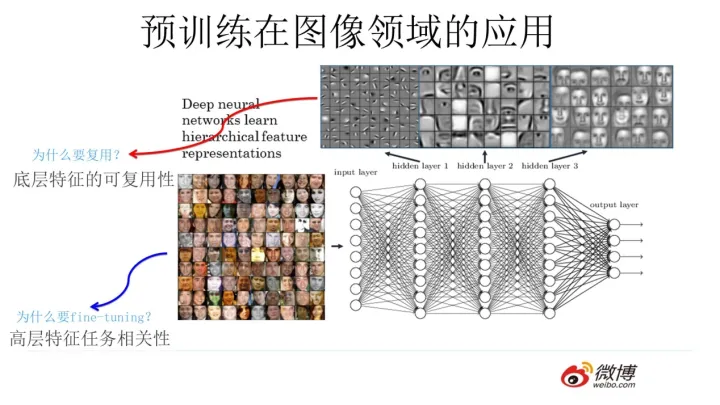

# 🌌 before-llm-era

## 预训练技术的兴起

自从深度学习火起来以后，数据获取是越来越大的问题。对于深度模型而言，追求更高的精度从某种方面也意味着模型更加精细，参数量的增加也增大了对数据的需求。高质量、数量大的训练数据，特别是下游子领域的训练数据获取难度逐渐增加。如何在有限的下游领域数据中更好的训练模型成为了深度学习中重要的一环。

预训练，作为下游领域正式训练前的任务，本质上是对模型参数的初始化。相比于其他参数初始化的方式，预训练可以在大范围领域中将模型参数初始化到合理的值，即在大量的通用领域数据上训练模型，该阶段并不针对下游任务。通过预训练，模型能够掌握部分特征提取逻辑，并将通用领域的知识注入到参数中。这样能够加快下游任务的收敛速度，同时能够在更高的起点上更新模型，从而取得更好的推理效果。

<figure><figcaption>
Pretrain in CV domain
</figcaption></figure>

在图像和视频领域，预训练早就成为常规有效的做法。例如Resnet/Densenet/Inception等网络会在ImageNet上进行训练，并且作为其论文的指标进行横向对比。下游任务可以通过其开源参数进行初始化，再训练下游任务的数据集。

要说明为什么预训练能成功，就要分析预训练中参数都学习到了什么。以基于CNN的人脸识别为例，底层网络学习到低阶特征（耳朵、眼睛等五官信息），而顶层网络学习到高阶特征（轮廓等）。越是通用数据集中，低阶特征更能反应大领域中关注的部分，而高阶特征则与训练任务相关性更高（与输出层更接近）。简而言之，低阶特征复用的可能性更高。

基于此，对预训练模型的下游训练方式也分为三派：全量更新（Fine-Tuning）、部分更新（Frozen）和抽取部分层作为基座模型（Backbone）

* 全量更新（Fine-Tuning，有监督微调也称作Supervised Fine-Tuning，SFT）对所有层的参数进行更新，在下游任务上重新刷一遍。该方式可训练的参数量最大，理论上效果最好。不过可训练的参数量大也意味着对微调过程中的硬件需求增高，随着模型规模的增大变得更难实现。所以会借助其他调参方式（例如Lora）训练。
* 部分更新（Frozen）是将底层网络的参数固定，只更新顶层网络的参数。该部分相比于全量更新，减少了底层网络的梯度计算的显存需求，一定程度缓解了硬件压力。该方式也符合预训练的学习规律：即保留底层学习的通用特征，对任务相关性高的特征重新训练。
* 抽取部分层作为基座模型（Backbone）主要是采用部分或输出层以前的模型作为整体模型的核心部分，通常不更新其参数。通过在Backbone前增加特征变换层、在Backbone后增加输出判别网络等网络结构，并在下游任务上更新这些子网络的参数。基座模型作为特征提取器，利用预训练的参数在整体模型中发挥作用。

## NLP领域的预训练技术

既然预训练技术取得了显著的成效，那自然语言处理领域是否能延续这一套训练方式呢？其实自然语言领域早就有与预训练同宗同源的训练方法，但是不叫“预训练”这个名称而已。最早的方式是通过“[词向量表征](before-llm-era/word-embeddings/)”的名称出现在NLP领域。

随着NLP领域的发展，不少生成式或判别式的自然语言模型也迅速发展，其中主要有两个分支：[Bert](before-llm-era/pre-trained-models/bert.md)和[GPT](before-llm-era/pre-trained-models/gpt.md)。
