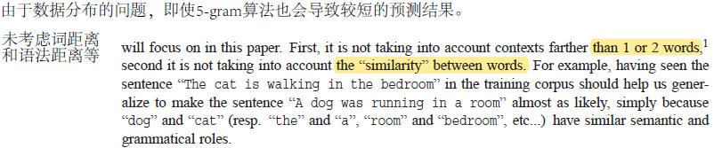
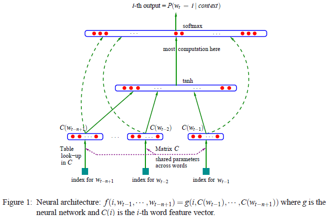
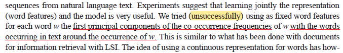

# NNLM

* 论文名称：A Neural Probabilistic Language Model
* 论文地址：[https://www.jmlr.org/papers/volume3/bengio03a/bengio03a.pdf](https://www.jmlr.org/papers/volume3/bengio03a/bengio03a.pdf)



## 基于统计的语言模型

其实本质的语言模型就是概率的连乘，概率的定义与具体的目标有关。比如：判断一个句子是否是机器生成的，那么分词后对原句子$s$可以划分成$w\_1, w\_2, \cdots, w\_n$个分词，那么对于序列的数据，可以由连续概率得：

$$
P(w_1, w_2, \cdots, w_n) = p(w_1) \cdot p(w_2 | w_1) \cdot p(w_3|w_1,w_2) \cdots p(w_n| w_1, w_2, \cdots, w_{n-1})
$$

在其中，每个词的概率都与前向文本有关。当然，双向的概率也是另一种考虑形式，比如将数据倒转后，可以得到后向的概率。但是，明眼人一看这与文本长度有关的设计变数太大，对长输入带来庞大的计算量也难以负担。所以统计的语言模型采取了取巧的设计：仅跟前n个有关。

### n-gram

由上述进一步思考，对句子成分中划分成不超过n个的短句组，那么每个短句组的概率都可以通过上述的方式计算得出。那么总体句子的概率就可以用短句组的概率乘积来表示。

$$
P(s)=\Pi^{l-1}_{i=0}p(w_i)
$$

### n-gram的缺点

<figure><figcaption>
failure of n-gram
</figcaption></figure>

n-gram的想法很理想，但是在实践中出现了两个明显的缺陷：

1. 由于数据集不够大（一方面由于计算资源导致），导致很多词组、长词组并未包含。这导致结果多数只考虑了一两个词的短文本的情况（即使n设置得很大）
2. 无法刻画词距离或者语法距离等情况（例如：A likes B这种句型应该在中间masked的时候距离更近）

## NNLM（Neural Network based Language Model）

<figure><figcaption>
NNLM Model Structure
</figcaption></figure>

提出通过神经网络的方式刻画，并且将训练任务更正为Next-Item-Prediction。在论文中，提出了多层网络或通过除了前馈神经网络的方式（例如RNN）对文本进行建模，但是整体范式沿用的是一致的。

$$
y=b+Wx+U \tanh {(d+Hx)}
$$

为什么用原始的embedding输入拼接上隐层特征，论文中并没有说明。但是在论文中提到了一个有意思的事情：论文尝试通过目标词附近的语料特征对目标词的embedding进行修正，但是这个尝试失败了。所以我推测网络的设计应该是希望隐层做特征提取，与原输入进行拼接，再过线性层进行预测。

<figure><figcaption>
failure in featuring
</figcaption></figure>
