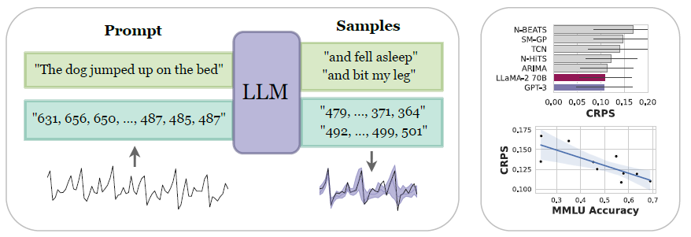
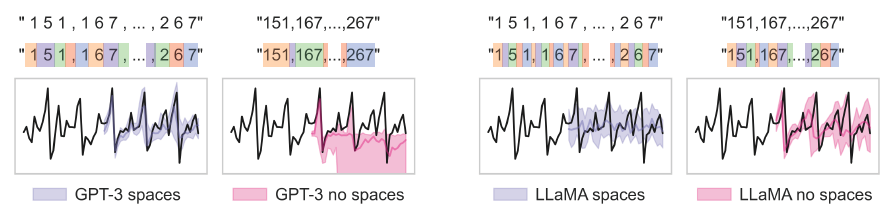
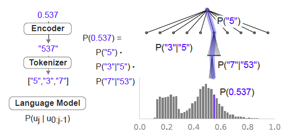

# Large Language Models Are Zero-Shot Time Series Forecasters \[NeurIPS2023]

* 论文地址：[https://arxiv.org/abs/2310.07820](https://arxiv.org/abs/2310.07820)

<figure><figcaption></figcaption></figure>

基本的时间预测，通过直接将时序数据用逗号分隔的方式转换成文本输入，通过模型生成其输出以逗号分隔的预测窗口数据。

* 文本生成模型是自回归模型，天然将文本token按位循环预测下一输出，与时序预测任务形式相同。
* 由于是研究Zero-Shot的效果，即在不训练的前提下进行预测，没有训练开销。
* 与深度模型不同的是，深度模型能够将数值读成一个整体，而文本生成模型由于Tokenizer的原因，对不同的模型和文本有不同的切分形式，所以该文章针对这一问题做出以下修正方案。

## 针对数字Token的改进

<figure><figcaption>
不同tokenizer对不同数字格式区分
</figcaption></figure>

由于部分模型的Tokenizer对数字的切分方式不同，从而导致tokenize后对数字变化的表征不同。为了将数字按位划分，需要在黏着分词器（GPT-3）的输入文本中，将数字调整成空格分隔的形式（如果存在空格+数字的token）。而对非黏着分词器（LLaMa）这么做会导致模型认知不同，导致预测结果不好。

## 针对数值范围的改进

由于输入token数量的限制，序列如果本身数值大的会导致token数量变多，与自身变化无关，所以对数值范围进行标准化：

* 对LLaMa，论文采用sklearn.preprocessing.MinMaxScaler进行数值缩放（保留8位小数）
* 论文说GPT-3能够处理不同维度的数值，所以对GPT-3的数据采用的是仿射变换（affine transformation），具体公式如下

$$
(x_1, x_2, ...,x_T):x_t \Rightarrow (x_t - b)/a \\ b=min(x_t) -  \beta(max(x_i)-min(x_i))
$$

其中，beta是超参数，alpha是序列按位的百分位数。

## 针对随机性的改进

由于是zero-shot，部分模型并不能do\_sample=False，导致结果受到随机性影响。所以论文在预测时多次预测（20次）取平均。

对文本生成的超参数（temperature scaling, logit bias, and nucleus sampling）做网格搜索，GPT搜索alpha、beta、temperature和precision，对LLaMa只搜索temperature，use α = 0.99, β = 0.3, precision = 3, nucleus = 0.9。

## 对生成概率改进，由于生成的文本

<figure><figcaption></figcaption></figure>

由于数据已经经过标准化，所以只考虑小数部分的连续概率。

## 结论

LLM可以找到数据的低复杂性解释，使他们能够zero-shot外推[数值序列](https://www.zhihu.com/search?q=%E6%95%B0%E5%80%BC%E5%BA%8F%E5%88%97\&search\_source=Entity\&hybrid\_search\_source=Entity\&hybrid\_search\_extra=%7B%22sourceType%22%3A%22answer%22%2C%22sourceId%22%3A3251779729%7D)
