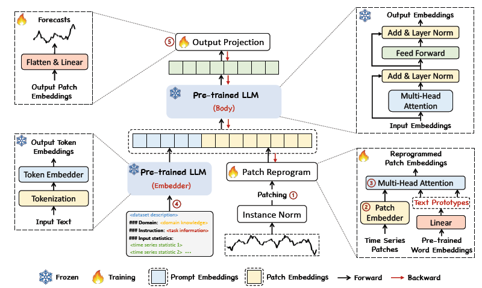
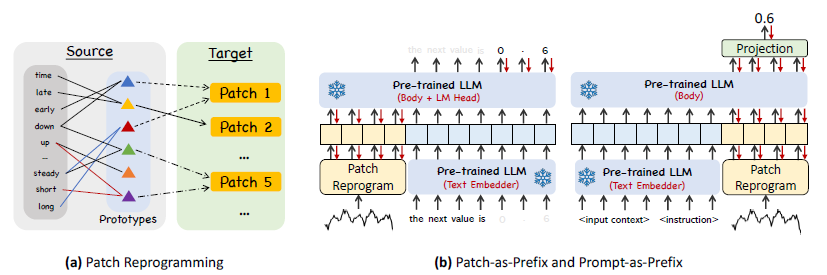

# Time-LLM: Time Series Forecasting by Reprogramming Large Language Models \[ICLR 2024]

论文地址：[https://arxiv.org/abs/2310.01728](https://arxiv.org/abs/2310.01728)

<figure><figcaption>
Time-LLM Model Structure
</figcaption></figure>

## Data Reprogramming

由于目标是在不更新body model的情况下，对输入序列映射成合适的特征序列，激发body model的能力。所以需要做下游任务与与训练任务的映射。而在图像和音频领域常用的方法（预训练中修改数据，增加噪声，增强模型泛化迁移能力）在文本和时序领域不适用，原因有：

* 文本的token是离散的，不像图像和视频具有可编辑性
* 文本的噪声不好定义
* 不同文本任务间的learnable transformation也不好定义

希望通过类线性的方式，将输入维度的时序部分映射到原模型的语义空间，并能够在不微调模型的前提下激发模型对时序数据的推理能力和对结果的reasoning能力，从而完成时序预测的任务。

<figure><figcaption></figcaption></figure>

论文为了加快收敛，避免无关语义的token词向量与输入关联，预先从全量词表中人工挑选相关词表的子集（论文中叫prototypes），并且对原此表通过线性层映射到该子集上（类似降维）。然后讲语义空间表征作为key和value，将时序patch的embedding作为query，通过Cross-Attention获得时序数据在语义空间中的表征向量。

## Prompt-as-prefix

这部分主要是领域知识注入（感觉就像灌水）。想法是（感觉是为了体现与One Fits All的区别），将时序embedding作为部分输入，留出前缀或后缀，用作领域知识的embedding注入。

领域知识的embedding是通过同一个大模型作为encoder提取的语义向量，并且很不靠谱的提出了一个很扯淡的方案：

* Patch-as-Prefix（就是把时序数据放前面，领域知识放后面）
  * 自回归时，时序数据与预测数据割裂
  * 提出的方法中，要求输出为固定格式的自然语言文本，幻觉生成严重
  * 不好解析，格式并不能完全固定
* Prompt-as-Prefix（领域知识在前，时序在后，合理）
  * 大模型仅用作提取特征，将对应Patch输入位对应的输出位上的向量作为特征，输入预测网络，推理下一输出
  * 领域知识中概述时序数据构成、任务形式以及其他领域instruction，时序patch作为数据输入

## 标准化

正常的instance norm和patching

