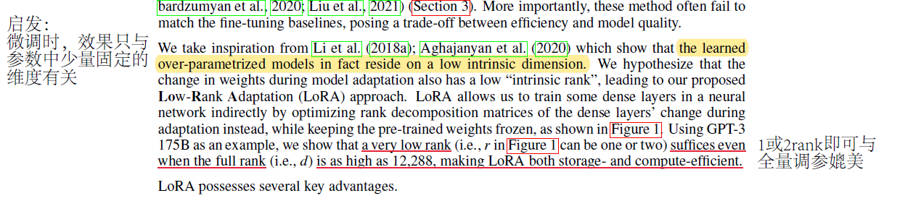
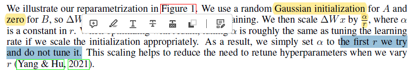
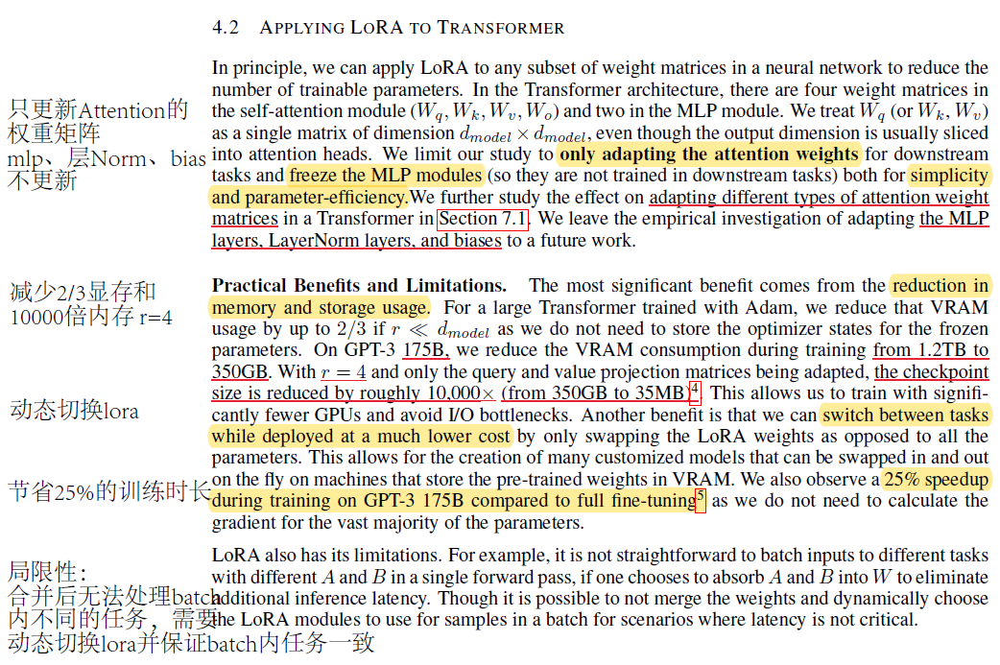

# Lora

* 论文地址：[https://arxiv.org/abs/2106.09685](https://arxiv.org/abs/2106.09685)
* 论文官方代码地址：[https://github.com/microsoft/LoRA](https://github.com/microsoft/LoRA.)
* Lora在Huggingface PEFT中的代码地址：[https://github.com/huggingface/peft](https://github.com/huggingface/peft)

## 启发点

作者称受到（[Intrinsic Dimensionality Explains the Effectiveness of Language Model Fine-Tuning](https://link.zhihu.com/?target=https%3A//arxiv.org/abs/2012.13255)这篇论文的影响，认为：`预训练模型在微调时，$\delta$矩阵仅依赖于固定低维的向量`

<details>

<summary>预训练模型在微调时，$\delta$矩阵仅依赖于固定低维的向量</summary>

We take inspiration from Li et al. (2018a); Aghajanyan et al. (2020) which show that the learned over-parametrized models in fact reside on a low intrinsic dimension.&#x20;

Intrinsic dimension

* Intrinsic的本意是：内在的、固有的。intrinsic dimension在这里应该是说整个大的Δ矩阵只在某些低维固有的方向上起决定性左右，意译为本质维度？

</details>

<figure><figcaption><p>Inspiration of LoRA</p></figcaption></figure>

既然只有少量的维度有效，参考矩阵分解的方式能够有效减小存储的大小。感觉还是受到矩阵分解方向的影响，但是作者没有明说（跟Bert说受到完形填空的启发，但是也有可能是CBOW的影响）。

### 为什么不用SVD方式（Difference）

SVD需要一个确定的Δ矩阵，在获得这个矩阵的过程中，已经需要对预训练参数进行全量微调，那在参数更新的过程中进行矩阵分解有点脱裤子放屁的嫌疑。如果是在保存时进行矩阵分解，又起不到减小显存的效果，反而还需要对SVD进行额外的开销。如果通过EM的方式，一步更新Δ一步更新SVD的话，时间开销会大大增加。

总而言之，SVD不能在更新的同时不进行全量微调，进行了全量微调就没有必要在更新时再进行SVD。

## 公式

$$
\Delta Wx=\frac {\alpha} {r} B A x\\ B \in \mathbb{R}^{d \times r},\ A \in \mathbb{R}^{r \times k}
$$

* r是lora的rank，既分解后矩阵的维度
* 矩阵A和矩阵B通过点乘的方式变成与原参数矩阵维度相同的大小，可以通过对位相加合并
* $\alpha$是一个超参，论文中根据第一次实验设置的值就固定下来了。作用是对噪声更小的$\delta$权重放大其变化率和更新率

### 初始化方式

<figure><figcaption></figcaption></figure>

对$\alpha$随机设定成一个固定的值，在huggingface peft中是8。

论文中说对A使用高斯分布的随机初始化，对B初始化成0。不过在作者实际上并没有发现相反的初始化会带来什么新的问题。他在[issues](https://github.com/microsoft/LoRA/issues/98)中回复到：可以反过来初始化，即其中一个随机初始化，另一个初始化成0即可。[https://github.com/microsoft/LoRA/issues/98](https://github.com/microsoft/LoRA/issues/98)

## 微调效果

### 可以节约显存（1/3倍）、训练时间（25%）和存储（10000倍，r=4）

可以节约显存和存储，因为大部分参数不需要存储梯度。但是！<mark style="color:red;">实际计算梯度的显存是大于全量调参的，并不能节约计算</mark>！

$$
\frac {\partial L} {\partial B}  = \frac {\partial L} {\partial W} \cdot \frac {\partial W} {\partial B} = \frac{\partial L} {\partial y} \cdot \frac {\partial y} {\partial W} \cdot \frac {\partial W} {\partial B} = \frac{\partial L} {\partial y} x^{\intercal}A^{\intercal}
$$

其中，$\frac{\partial L} {\partial y} x^{\intercal}$的shape是$d \times k$，与原参数矩阵的大小相同。只不过这部分在计算完后可以释放掉，所以最后缓存时的参数矩阵更小，并不是计算次数更少。

### 可以通过切换不同的lora矩阵实现下游任务的快速切换

作者认为，实际更新矩阵的参数量小了，那么相同的内存下，就可以加载多份lora参数，针对不同的下游任务切换不同的lora矩阵

### 可以实现无额外推理时延

由于lora的矩阵分解方式是线性的，所以可以通过预先参数合并的方式将$\delta$矩阵合并到原参数上，那么推理时与原模型除了参数数值，其他完全一致，即可实现无额外推理时延。这也是针对baseline的微调方法对比的优势。

```python
// Some code
# 注：当调用 model.eval() 时就会调用 train(mode=False)
# 将低秩矩阵 A, B 合并至原权重矩阵 W
if not mode and self.merge_weights and not self.merged:
    # Merge the weights and mark it
    if self.r > 0 and any(self.enable_lora):
        # \delta_W = BA
        delta_w = (
            # 这里使用1维卷积将低秩矩阵 A, B 进行“融合”：
            # A(r * k) 作为输入，r 看作是其 channel，k 看作是空间维度上的大小；
            # B(d * r * 1) 作为卷积权重，d 是 output channel, r 是 input channel, 1 是 kernel size(注意B本身就是用1维分组卷积实现的)。
            # 由于是卷积，因此二维的 A 需要增加一维给 mini-batch：r * k -> 1 * r * k。
            # 卷积后，输入(1 * r * k) -> 输出(1 * d * k)
            F.conv1d(
                self.lora_A.weight.data.unsqueeze(0),
                self.lora_B.weight.data,
                groups=sum(self.enable_lora),
            )
            .squeeze(0)  # 1 * d * k -> d * k
            .transpose(-2, -1)  # d * k -> k * d
        )
        # zero_pad() 是对低秩分解矩阵 \delta_W 进行0填充，因为原权重矩阵 W 中可能有些部分没有进行低秩分解，
        # 从而得到一个和原权重矩阵 W 的 shape 对齐的结果，以便进行加和。k * d -> k * D(假设 D 是原权重矩阵 W 的 out features)
        # 对于原权重矩阵 W 是 Linear 层的情况，fan_in_fan_out = False，于是这里会进行 transpose: k * D -> D * k；
        # 而对于原权重矩阵 W 是 GPT-2 的 Conv1D 的情况，fan_in_fan_out=True，于是不需要 transpose，它的 out features 就是放在第二维的
        # W = W + # \delta_W
        self.weight.data += transpose(self.zero_pad(delta_w * self.scaling), not self.fan_in_fan_out)
```

### 可以和其他微调方式并存

### 可以应用到任何dense layers上

## 微调不足

### 合并后无法处理batch内不同的任务

合并后，同一个batch内必须是同一个lora矩阵的任务。在线上推理时，可能会导致小batch甚至单条预测，减缓推理速度。

<figure><figcaption><p>Reading Notes</p></figcaption></figure>

## 论文实验

[experience1-effectiveness.md](experience1-effectiveness.md "mention")

[experience2-hyper-parameters.md](experience2-hyper-parameters.md "mention")

[experience3-mechanism.md](experience3-mechanism.md "mention")
