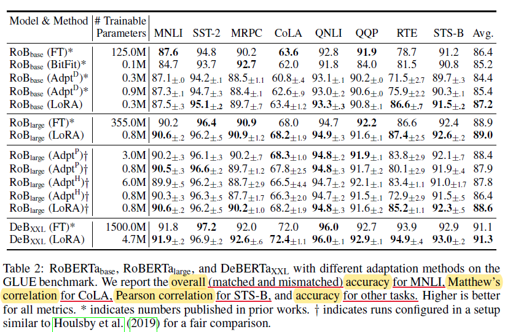
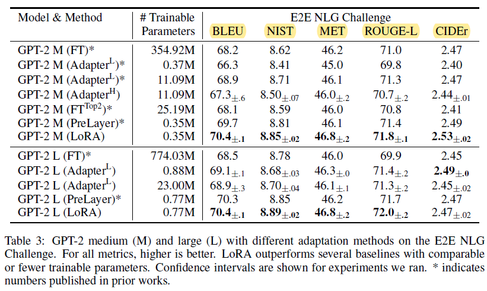
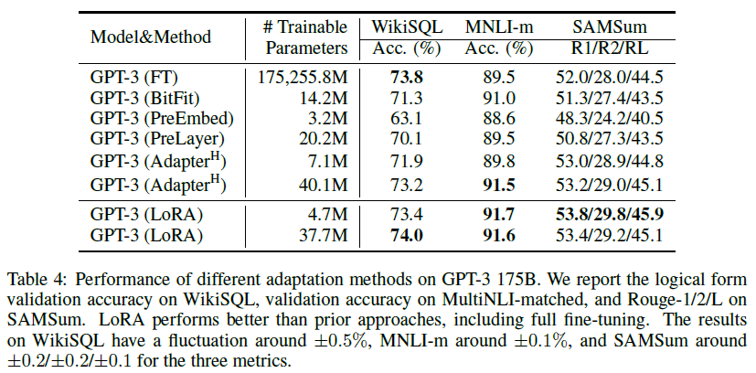
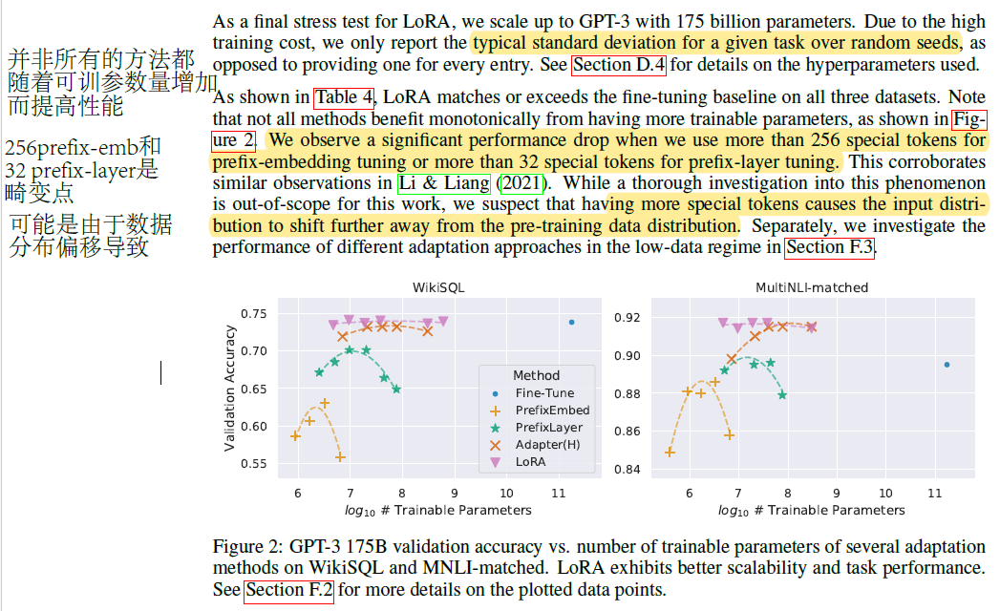

# Experience1 Effectiveness

## 小模型NLP任务中LoRA的表现

Lora的论文先做了一个实验，验证在NLP领域中transformer based的模型中的效果。这个实验对比了多个模型（RoBERTa (Liu et al., 2019), De- BERTa (He et al., 2021), and GPT-2 (Radford et al., b)）和多个现有的微调方法（Fine-Tuning、Bias-only or BitFit、Prefix-embedding tuning、Prefix-layer tuning、Adapter tuning）在多种任务下的效果（MNLI、SST-2、MRPC、CoLA、QNLI、QQP、RTE、STS-B、E2E NLG Challenge）。

该部分实验中，lora只更新transformer中的q、v矩阵。

其中，在翻译的数据集上还做了zero-shot的迁移学习（在MRPC、RTE和 STS-B上预训练；在MNLI上预测）。都采用输入长度为128和相同的batch size。

<figure><figcaption>
Natural Language Understanding Task Performance
</figcaption></figure>

<figure><figcaption>
Natural Language Generation Task Performance
</figcaption></figure>

在多个任务和模型上证实了lora微调方式能够在小模型的NLP任务上起到较好的作用。其中值得一提的是，lora的参数量最小，但是效果在多个任务中达到最优。

## 大模型NLP任务中LoRA的表现

上述实验在小模型上取得了很好的成绩，那么LoRA在大模型上表现如何？论文分别在多个数据集（WikiSQL、MNLI-m和SAMSum）上对比，并且采用了两种不同的LoRA rank（rank=1--4.7M；rank=8--37.7M）。

<figure><figcaption>
LoRA on GPT3 performance
</figcaption></figure>

实验证明，只需要较小的rank，LoRA的调参方式就能取得最优效果。

### 可学习参数量上涨不一定带来更好的结果

实验有一个意外发现：模型的效果不一定随着可学习的参数量增加而变好，特别是在某些方法中，拐点体现的特别明显。

<figure><figcaption>
Tuning Point for Scales of Trainable Parameters
</figcaption></figure>

特别是对于Prefix系列的，无论是Prefix-embedding Tuning（256是turning point）还是Prefix-Layers Tuning（32是turning point），都会在一个峰值后效果极速下降。论文作者认为是由于注入过多的特殊tokens，导致与预训练的数据分布差异过大，存在数据偏移。从而导致训练的效果变差。
