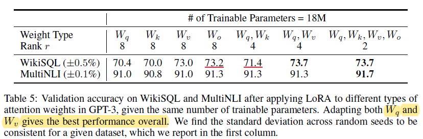
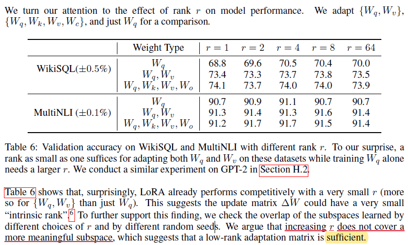

# Experience2 Hyper-parameters

由于$\alpha$是预先设定的值，所以对于LoRA来说，最关心的超参有：

* 在Attention的什么位置使用LoRA的旁路矩阵？
* LoRA的rank怎么设定，增加rank是否有新的收益？

## 少rank多矩阵更新（QV更新）

实验设定为固定显存大小的场景，固定可学习的参数大小为18M。该大小对应一个矩阵（Q/K/V/O）在rank=8的情况下微调。如果增加一个矩阵，那么rank会减小一半。

<figure><figcaption>
Trainable Parts Exp
</figcaption></figure>

实验分析得，仅更新QV矩阵能够获得最好的效果，但是图表中明明是四个矩阵同时更新。但是实验结论还是比较成立的：在多个矩阵上用少量的rank更新比在一个矩阵上使用较大的rank更新效果好。

实验还发现一个值得注意的地方：在QK上更新会导致效果显著下降。但是该发现并未分析原因。

## 少量rank即可以达到较好的效果

<figure><figcaption></figcaption></figure>

实验认为，小量的rank已经可以达到较好的效果，增加rank并不能带来线性的增益（所映射的子空间并没有包含更多信息）。
