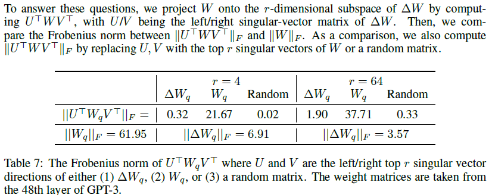

# Experience3 Mechanism

为了探究LoRA到底是怎么运作的，LoRA论文进行了两个方向的实验：

* 验证为什么少量Rank即可以达到较好的效果（回应实验2的结论）
* 探究LoRA方式学习到的矩阵跟原预训练矩阵的关系

## 为什么更新少量参数即可达到不错的效果

<figure><figcaption></figcaption></figure>

为了探究为什么小rank可以取得较好的效果，论文训练了一大一小两个不同Rank的LoRA矩阵（大r矩阵Rank=64，小矩阵Rank=8），并对他们SVD分解后的右奇异单位矩阵做相似性分析。相似性的评判指标用的是 [Grassmann Distance](https://dl.acm.org/doi/10.1145/1390156.1390204) ，具体公式如下：

$$
\phi(A_{r=8}, A_{r=64}, i, j) = \frac {{||{{A_{r=8}^i}^{\tau}{A^j_{r=64}}}||}_{F}^{2}} {min(i, j)} \in [0,1]
$$

实验发现在SVD分解后，Top Rank的相关性很高，而排后面的向量相关性很低，证明无论Rank的值取大还是小，对与下游子任务中有用的部分（共性的部分）是Top Rank向量所代表的。该发现与启发点一致：$\delta$矩阵依赖于固定低维向量。

<figure><figcaption></figcaption></figure>

为了消除初始化的影响，论文在两个随机种子训练了两个Rank=64的LoRA矩阵，并对其第48层的QV的$\delta$向量进行相关性分析，得到相同的结论。该实验中还发现了Q的秩应该比V的秩大（相似性高的部分更多）。

## 更新矩阵和预训练矩阵的关系

<figure><figcaption></figcaption></figure>

对于少量参数更新的部分与原预训练参数是什么关系这个问题，论文也进行了探索。论文在不同的Rank（Rank=4，Rank=64）下将原预训练矩阵分解到$\delta$矩阵上。为了比较Frobenius Norm的大小，还设置了两个对照组（映射到自身矩阵、映射到随机矩阵）。


Frobenius Norm就是矩阵差的平方和再开方


由结果可知，$\delta$矩阵的参数与原预训练参数相关性比随机矩阵大，由此，论文认为：Lora学习到的参数是从预训练中获得 但未被强调的。简而言之，**Lora能从预训练参数中提取对应任务的先验知识并放大其能力**。
